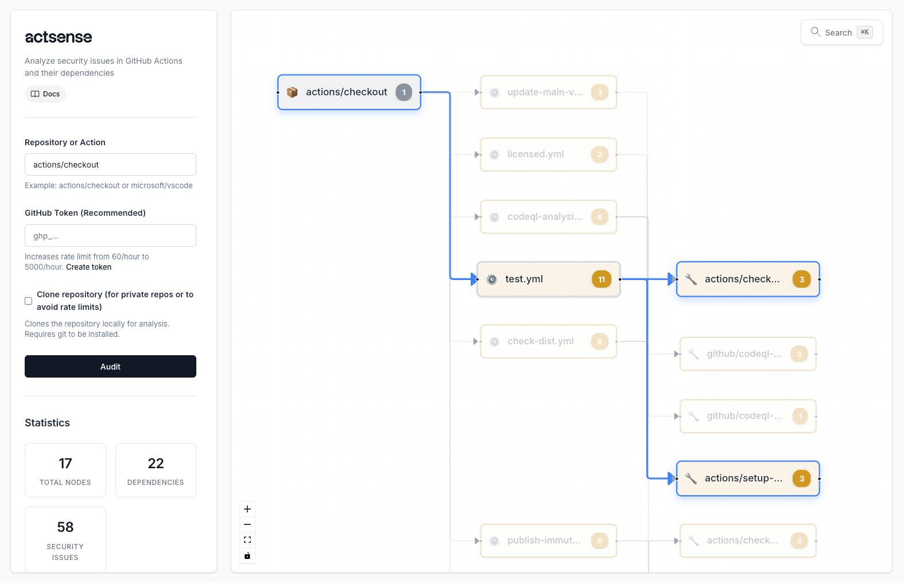

<div align="center">

# actsense

[](https://actsense.dev)
[](https://opensource.org/licenses/GPL-3.0)
[](https://github.com/0xCardinal/actsense)
[](https://github.com/0xCardinal/actsense/pulls)



A security auditor for GitHub Actions that analyzes workflows and their dependencies to identify security vulnerabilities.

**🙌 Refer to [https://actsense.dev](https://actsense.dev) for the guide 📖**

</div>

## Features

- 🔍 **Comprehensive Security Auditing**: Detects 30+ security issues in GitHub Actions workflows
- 📊 **Interactive Graph Visualization**: Visualize action dependencies with an interactive graph
- 🔎 **Powerful Search**: Search security issues and assets with natural language queries (Cmd+K / Ctrl+K)
- 📋 **Table Views**: View nodes and dependencies in organized table formats
- 🔗 **Transitive Dependency Analysis**: Automatically resolves and audits all action dependencies
- 💾 **Analysis History**: Save and load previous analyses
- 🔐 **Multiple Analysis Methods**: Use GitHub API or clone repositories locally
- 📖 **Detailed Issue Documentation**: Each vulnerability links to comprehensive documentation on actsense.dev
- 🎨 **Modern UI**: Clean, professional interface built with React


## Installation

For detailed installation instructions including Docker, quick setup, and manual installation options, see the [Getting Started guide](https://actsense.dev/getting-started/).

## Usage

For a comprehensive guide on using actsense, including interactive features, search functionality, and detailed analysis capabilities, see the [Usage documentation](https://actsense.dev/usage/).

## GitHub Token (Optional)

A GitHub Personal Access Token increases rate limits from 60/hour to 5,000/hour.

[Create a token](https://github.com/settings/tokens) with `public_repo` scope (or `repo` for private repos).

## Security Checks

actsense detects issues including:
- Unpinned action versions
- Older action versions (checks against latest from GitHub)
- Inconsistent action versions across workflows
- Hardcoded secrets
- Overly permissive permissions
- Unpinnable actions (Docker, composite, JavaScript)
- Script injection vulnerabilities
- Untrusted third-party actions
- And 30+ more security issues

## Configuration

### Trusted Action Publishers

By default, actsense flags actions from unknown publishers when secrets are passed to them. You can configure which publishers are trusted by editing `backend/config.yaml`.

**To add a trusted publisher:**

1. Open `backend/config.yaml`
2. Add the publisher prefix to the `trusted_publishers` list:

```yaml
trusted_publishers:
  - "actions/"
  - "github/"
  # ... existing publishers ...
  - "your-org/"
```

3. Restart the application

**Example:** To trust `0xCardinal/Publish-Docker-Github-Action@v5`, add `"0xCardinal/"` to the list. This will trust all actions from the `0xCardinal` organization.

## Documentation

### Vulnerability Documentation

Each security issue detected by actsense includes:
- **Title and Description**: Clear explanation of the vulnerability
- **Evidence**: Specific details about where and how the issue was found
- **Mitigation Strategy**: Step-by-step guidance on how to fix the issue
- **External Reference**: Links to comprehensive documentation on [actsense.dev](https://actsense.dev)

All vulnerability documentation is available at `docs/content/vulnerabilities/` and hosted on [actsense.dev](https://actsense.dev/vulnerabilities).

## Contributing

See [CONTRIBUTING.md](CONTRIBUTING.md) for technical details, API documentation, and development guidelines.

## Contributors

Thank you to all contributors who help make actsense better!

<table>
    <tr>
    <td align="center"><a href="https://github.com/0xCardinal"><br />0xCardinal</a></td>
    </tr>
</table>

Made with ❤️ by the actsense team
