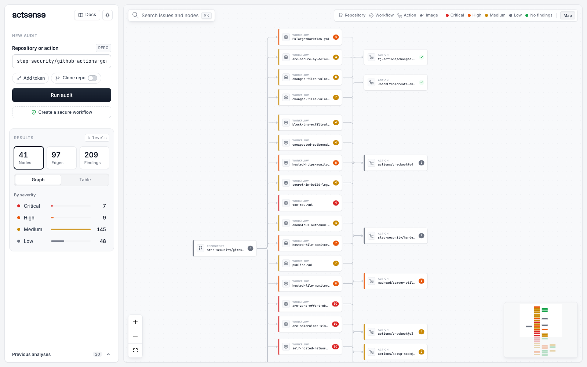

<div align="center">

# actsense

[](https://actsense.dev)
[](https://opensource.org/licenses/GPL-3.0)
[](https://github.com/0xCardinal/actsense)
[](https://github.com/0xCardinal/actsense/pulls)



**Workflow Security Auditor.** Maps every dependency your CI workflows run, at the version they run, and audits each one. GitHub Actions is supported today; the architecture is built so other workflow platforms can follow.

**🙌 Refer to [https://actsense.dev](https://actsense.dev) for the guide 📖**

</div>

## Features

- 🔍 **Comprehensive Security Auditing**: Detects ~70 security issues and exposures in GitHub Actions workflows
- 📊 **Interactive Graph Visualization**: Visualize action dependencies with an interactive graph
- 🔎 **Powerful Search**: Search security issues and assets with natural language queries (Cmd+K / Ctrl+K)
- 📋 **Table Views**: View nodes and dependencies in organized table formats
- 🔗 **Transitive Dependency Analysis**: Automatically resolves and audits all action dependencies
- 💾 **Analysis History**: Save and load previous analyses
- 🔐 **Multiple Analysis Methods**: Use GitHub API, clone repositories locally, or analyze YAML directly
- ✏️ **YAML Editor**: Paste and analyze workflow YAML directly with real-time validation
- 📖 **Detailed Issue Documentation**: Each vulnerability links to comprehensive documentation on actsense.dev
- 🎨 **Modern UI**: Clean, professional interface built with React


## Installation

For detailed installation instructions including Docker, quick setup, and manual installation options, see the [Getting Started guide](https://actsense.dev/getting-started/).

## Usage

For a comprehensive guide on using actsense, including interactive features, search functionality, and detailed analysis capabilities, see the [Usage documentation](https://actsense.dev/usage/).

### GitHub Action

Add `.github/workflows/actsense.yml`:

```yaml
name: actsense
on:
  pull_request:
  push:
    branches: [main]

permissions:
  contents: read

jobs:
  scan:
    runs-on: ubuntu-latest
    permissions:
      contents: read
      security-events: write # upload SARIF to the Security tab
    steps:
      - uses: actions/checkout@3d3c42e5aac5ba805825da76410c181273ba90b1 # v7.0.1
        with:
          persist-credentials: false
      - uses: 0xCardinal/actsense@0109eef6bd850da2b71d5232c572636ece195098 # 1.3.0
        with:
          fail-on: high
```

On pull requests only findings the PR introduces count toward `fail-on`: the action scans the PR's base commit too and compares finding fingerprints, so a repository with 200 existing findings can adopt it without failing every PR. Every finding still goes to the Security tab, where GitHub shows the new ones inline on the PR, and a summary is written to the job page.

| Input | Default | |
| --- | --- | --- |
| `path` | `.` | Directory, workflow file or `action.yml` to scan |
| `fail-on` | `high` | `critical`, `high`, `medium`, `low` or `none`. Start with `critical` and tighten later |
| `min-severity` | `low` | Leave lower-severity findings out of the report |
| `diff-base` | PR base commit | Git ref to compare against; empty to gate on every finding |
| `baseline` | | Baseline file from `actsense scan --write-baseline`, used instead of `diff-base` |
| `online` | `false` | Use the GitHub API for outdated, deprecated and missing actions |
| `upload-sarif` | `true` | Upload to code scanning. Set `false` on private repositories without GitHub Advanced Security and on pull requests from forks, whose tokens can't write security events |
| `sarif-file` | `actsense.sarif` | Where the SARIF report is written (also the `sarif-file` output) |
| `category` | `actsense` | Code scanning category |

The `exit-code` output is `0` (passed), `1` (findings at or above `fail-on`) or `2` (bad input). Pin the action by full commit SHA as above; Dependabot and Renovate keep the SHA and its version comment up to date.

### Command line

`actsense scan` runs the same checks against a local checkout, with no server or frontend:

```bash
cd backend && uv sync
uv run actsense scan /path/to/repo --format sarif --output actsense.sarif --fail-on high
```

It scans `.github/workflows/*.yml` and every `action.yml` in the tree, skipping `node_modules`, `vendor` and gitignored files. You can also point it at a single workflow or `action.yml` file.

| Option | Default | |
| --- | --- | --- |
| `-f, --format` | `text` | `text`, `json`, `sarif` (SARIF 2.1.0) or `markdown` |
| `-o, --output` | stdout | Write the report to a file |
| `--summary-file` | | Also append a Markdown summary, e.g. to `$GITHUB_STEP_SUMMARY` |
| `--fail-on` | `high` | Exit 1 if any (new) finding is at or above this severity; `none` never fails |
| `--min-severity` | `low` | Leave lower-severity findings out of the report |
| `--diff-base REF` | | Also scan this git ref; only findings it doesn't have count toward `--fail-on` |
| `--baseline FILE` | | Only findings missing from this file count toward `--fail-on` |
| `--write-baseline FILE` | | Record the current findings as a baseline and exit 0 |
| `--online` | off | Use the GitHub API (`GITHUB_TOKEN`) for version, deprecation and missing-repository checks |
| `--repo` | origin remote | `owner/repo` of the checkout |
| `--public` | detected with `--online` | Treat the repository as public for the self-hosted runner checks |

Exit codes: `0` passed, `1` findings at or above `--fail-on`, `2` usage or input error.

Baselines match findings by fingerprint (file, rule and the finding's identifying details, not its line number), so moving code around doesn't make old findings new. To adopt the scanner on a repository with existing findings without comparing against a branch:

```bash
uv run actsense scan . --write-baseline .actsense-baseline.json
uv run actsense scan . --baseline .actsense-baseline.json --fail-on high
```

Without `--online` the scan is offline and deterministic. Remote actions are checked by their reference only, not fetched and followed as they are in the web app.

## GitHub Token (Optional)

A GitHub Personal Access Token increases rate limits from 60/hour to 5,000/hour.

[Create a token](https://github.com/settings/tokens) with `public_repo` scope (or `repo` for private repos).

## Security Checks

actsense detects issues including:
- Unpinned action versions
- Older action versions (checks against latest from GitHub)
- Inconsistent action versions across workflows
- Hardcoded secrets
- Overly permissive permissions
- Unpinnable actions (Docker, composite, JavaScript)
- Script injection vulnerabilities
- Untrusted third-party actions
- And 30+ more security issues

## Configuration

### Trusted Action Publishers

By default, actsense flags actions from unknown publishers when secrets are passed to them. You can configure which publishers are trusted by editing `backend/config.yaml`.

**To add a trusted publisher:**

1. Open `backend/config.yaml`
2. Add the publisher prefix to the `trusted_publishers` list:

```yaml
trusted_publishers:
  - "actions/"
  - "github/"
  # ... existing publishers ...
  - "your-org/"
```

3. Restart the application

**Example:** To trust `0xCardinal/Publish-Docker-Github-Action@v5`, add `"0xCardinal/"` to the list. This will trust all actions from the `0xCardinal` organization.

## Documentation

### Vulnerability Documentation

Each security issue detected by actsense includes:
- **Title and Description**: Clear explanation of the vulnerability
- **Evidence**: Specific details about where and how the issue was found
- **Mitigation Strategy**: Step-by-step guidance on how to fix the issue
- **External Reference**: Links to comprehensive documentation on [actsense.dev](https://actsense.dev)

All vulnerability documentation is available at `docs/content/vulnerabilities/` and hosted on [actsense.dev](https://actsense.dev/vulnerabilities).

## Contributing

See [CONTRIBUTING.md](CONTRIBUTING.md) for technical details, API documentation, and development guidelines.

## Contributors

Thank you to all contributors who help make actsense better!

<table>
    <tr>
    <td align="center"><a href="https://github.com/0xCardinal"><br />0xCardinal</a></td>
    </tr>
</table>

Made with ❤️ by the actsense team
